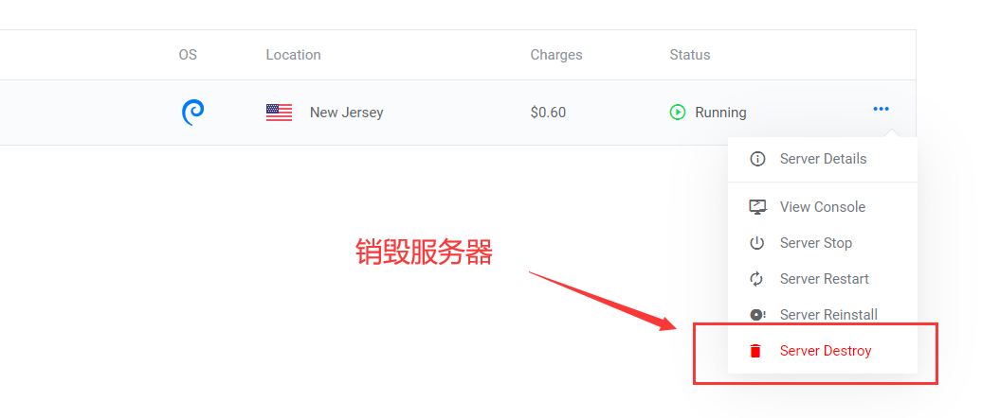

# 为什么要搭建博客？

博客在于记录和分享，有次和工作的前辈一起喝咖啡，他说现代人每天接触到的信息很多，获取知识很容易，但是形成自己的知识体系很难。慢慢回想起来，不知从什么时候开始我也很少花时间在个人总结输出上，只顾埋头写代码，生活上也止步于发送一两条自己都看不懂的朋友圈……
正巧赶上搬瓦工的vps没有续费，无法kexue上网，换了个服务器之后就有了在自己的服务器上搭建博客的念头。

# 使用个人服务器搭建博客的好处

### 与博客园、CSDN等相比
个性化是我最大的需求，如果博客丑到自己都看不下去，又何谈分享呢，自己搭建的博客能随意切换主题，挑到你满意为止。

况且自己搭建的博客还没有讨厌的广告，这点也很影响浏览体验。

### 与github page相比
之前使用github的page功能结合Hexo搭建过一次个人博客，总体来说比较方便，但有个致命缺点，在国内来说，github访问实在太慢。

我的vps虽然远在纽约，但是访问量很小，200多的延迟对于个人博客来说完全可以接受。

### 服务器的其他作用
主要是kexue上网啦~（其实主要作用就是这个）。这点我在另一篇博文会介绍。

# 思路概述
服务器上Hexo作为博客框架，Ngin作为反向代理。
同时考虑到vps性能比较差，在200ms的延迟上写博客属实有点蛋疼，我想实现的是在本地编写好博客后推送到服务器上。而Hexo正好支持git推送功能，因此我想到了在服务器上搭建一个git私服，本地写好后通过hexo d命令直接推送到服务器上。
后来我发现git私服存储的都是元文件，而不像github界面上那样的文件形式，但这点问题怎么可能难得倒我呢，我找到了git的一个hook功能，只需一个脚本就能拿到我的文件啦，这个后面会有介绍。
我还需要一个备份功能，毕竟服务器上跑的都是hexo生成的静态文件，源文件如果丢了就尴尬了。因此我将源文件上传到了github。如果换电脑也只需要clone下来，本地安装一下hexo就能继续推送到服务器了。

# 正文
开始之前，看这篇博文的朋友，如果你以后想搞开发，那么遇到问题一定学会自己检索，然后思考背后的原理，程序员其实就是个解决问题的职业，遇到困难，希望你有不达目的不罢休的精神和勇气。

## 第一步：购买vps
我的需求是访问不要太慢，运营商稳定（骗子网站数不胜数，刚买俩礼拜就凉了的可不少），当然，在此基础上价格越低越好。经过几番对比，vultr作为老牌vps服务商比较值得信赖，完全不需要担心服务商跑路，而且对比搬瓦工，vultr在有活动的时候价格还是很给力的。
我买的时候是充10$ 赠送50$, 相当于70多块钱能用17个月, 这个月活动更给力,送100$ ……（买早了QAQ）

#### 进入官网注册账号：[Vultr官网](https://www.vultr.com/?ref=8440446)

注册完开始充值,现在使用支付宝就可以直接充值了

#### 服务器选择：
点击加号就可以开始选择服务器了。

看到这么多地区先别慌，只需要测试下哪个地方延迟低一些就行。

打开cmd命令行，ping 你想测试的ip即可, 例如：
```
ping hnd-jp-ping.vultr.com
```
[各节点测速地址](https://www.vultryhw.cn/vultr-speedtest)

我选择的是3.5美元的纽约服务器。

操作系统选择debian9就行。

结合价格和延迟选择服务器,部署完成后，需要检测下该ip的22端口是否开放，( http://coolaf.com/tool/port )

如果端口没有打开，我们需要换个ip：

#### ip更换：
只需销毁服务器，然后重新部署即可，每次只花费0.01$，可以忽略不计。
**需要注意的是，最好先部署，确定能用了再销毁，否则可能会分配到重复的不能用的ip。**



## 第二步：后台部署


### 登陆到服务器
MobeXterm或者xshell都行，到官网上下一个，以root用户登陆，密码信息vultr上有。

登陆以后随便找个目录，例如:
```
cd /home/hexo
```

### 更新软件包
```
apt-get update
apt-get upgrade
```
### 安装依赖
Hexo 依赖于 Node.js 和 Git，需要先安装。

### 安装 Git
```
apt install git-core -y
```

### 查看 git 版本
```
git --version
```
### 安装 Node.js
```
wget -qO- https://raw.github.com/creationix/nvm/master/install.sh | sh
source ~/.profile
```
### 安装 Node.js
```
nvm install stable
```

### 查看node.js、npm版本版本
```
node --version
npm --version
```

### 安装 Hexo
```
npm install hexo-cli -g
```

新建空白目录
```
mkdir blog
cd blog
```
初始化hexo博客
```
hexo init
npm install
hexo g # 渲染 Source 目录下文件问静态页面
hexo s # 本地跑一个 server 来看博客效果。
```
然后可以在 http://{你的ip}:4000/ 查看运行效果。

## 第三步： 安装Nginx
Nginx 是一个高性能的 HTTP 和反向代理服务器，同时也是一个 IMAP/POP3/SMTP 代理服务器。

### 安装启动nginx
```
apt-get install nginx
service nginx start
```
配置完成后，访问使用浏览器服务器 ip ，如果能看到nginx界面，表示运行成功。

### nginx配置文件
nginx配置文件路径在/etc/nginx/nginx.conf
通过vi命令编辑文件
我们只需要在http 下，加入如下配置即可。
其中root 为你hexo init的那个目录下的public目录。
```
	server {
		listen 80;
		listen [::]:80;
		root /home/project/blog;
		index index.html index.htm index.nginx-debian.html;
		server_name www.zihou.site abc.com;
		location / {
		try_files $uri $uri/ =404;
		}
	}
```

这步是为了代理到hexo生成的文件,nginx配置文件修改后需要重启：
```
1、service nginx restart重启很快的，仅需要30秒。

2、nginx -s reload ：修改配置后重新加载生效。

3、nginx -s reopen ：重新打开日志文件。

4、nginx -t -c /path/to/nginx.conf 测试nginx配置文件是否正确。

5、nginx -s stop :快速停止nginx。

6、quit ：完整有序的停止nginx。
```

## 第四步： 搭建git私服
### 服务器端配置:
```
sudo adduser git
su git
cd
mkdir .ssh && chmod 700 .ssh
touch .ssh/authorized_keys&&chmod 600 .ssh/authorized_keys
```
### 公钥配置
然后在本地上拿到公钥放到该文件即可，取公钥的方法网上有很多，需要在本地安装git。

```
cat xx.pub >> ~/.ssh/authorized_keys
```

### 创建目录
找个目录新建git仓库，我还是习惯放在/home/git下

```
mkdir project.git
cd project.git
git init --bare
```
### 本地拉取测试
本地clone该仓库
```
git@{你的ip}:/home/git/project.git
```
如果需要输入密码，那就是git用户的密码，忘记密码可以百度下如何重置。

### 配置hooks
进入服务器上创建的git仓库，
修改post-update.sample文件，这是个样例文件
去掉后缀后可以在git commit后执行。
```
cd project.git
cd hooks
cp post-update.sample post-update
vi post-update
```
vi命令用i就可以进入编辑模式

修改为如下脚本：
其中GIT_REPO是git仓库地址
TMP_GIT_CLONE是临时路径
PUBLIC_WWW是hexo init的目录
```
#!/bin/sh
#
# An example hook script to prepare a packed repository for use over
# dumb transports.
#
# To enable this hook, rename this file to "post-update".

#exec git update-server-info
echo "Im update"
GIT_REPO=/home/git/project.git
TMP_GIT_CLONE=/home/tmp/blog
PUBLIC_WWW=/home/project/blog

rm -rf ${TMP_GIT_CLONE}
git clone $GIT_REPO $TMP_GIT_CLONE
rm -rf ${PUBLIC_WWW}
cp -rf ${TMP_GIT_CLONE} ${PUBLIC_WWW}
```
作用就是当我们提交的时候，会在服务器上clone出我们上传的文件，实现从元数据转换为文件形式。然后nginx就能正常读取到这些文件了。

这里要注意的是，我们上传的是生成好的public目录下的文件，因此nginx路径直接配置到blog即可，不需要再配置到public。


## 第五步： hexo本地编辑上传
可以先在github上新建一个仓库，用来存储源文件，修改本地hexo的_config.yml的deploy配置：

```
deploy:
  type: git
  repo:
    gitee: git@{你的ip}:/home/git/sample.git
  branch: master
  message: blog update
```
本地编辑好后通过hexo d 部署到服务器。

本地使用git push把所有文件上传到github。

至此实现了备份、博客、本地编辑等功能。

## 后续
hexo 的资料网上有很多，主题、分类、查询什么的有很多，我就不一一介绍了。

我的步骤可能有遗漏，但是经过验证，思路是没问题的，看博客的朋友在遇到问题、解决问题的同时，自己的技术也能得到锻炼哦^_^。